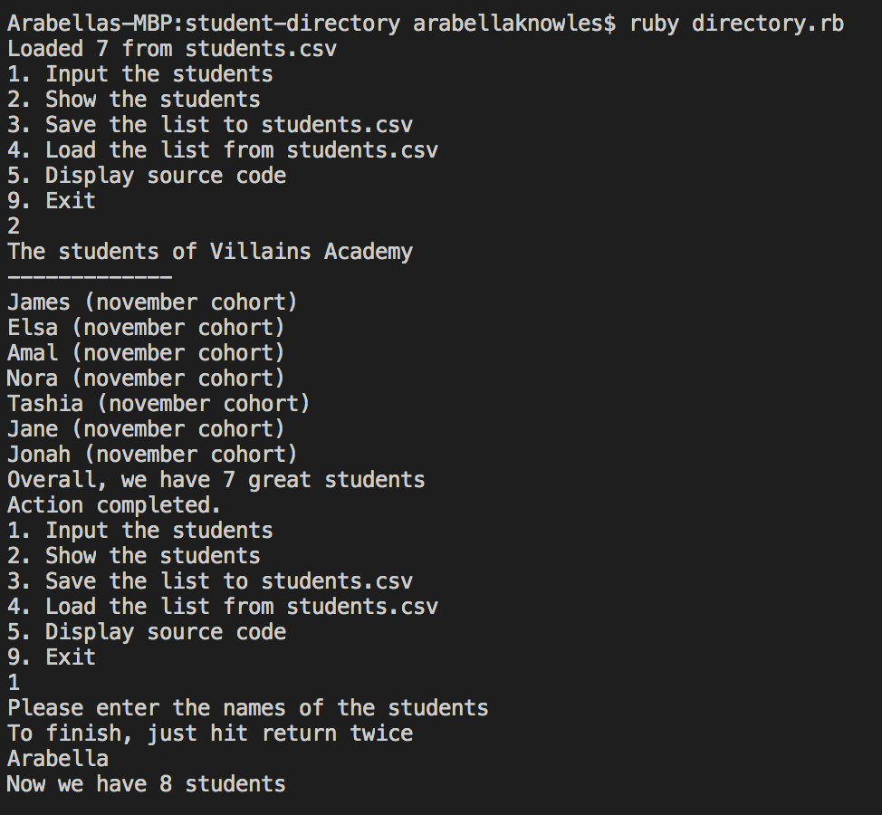

# Student Directory #

**This is a command line application that  allows you to manage the list of students enrolled at Villains Academy.**

The user is able to input names from the terminal, save the names to a csv file of choice, load the names from a csv file of choice and the list of students can be displayed in the terminal upon request. This program also contains a quine, enabling the user to view the source code in the terminal.

## How to use ##
1) In your terminal, run:
```shell
ruby directory.rb
```
2) You will then be provided with a list of available actions. Input the number according to which action you would like to take:

